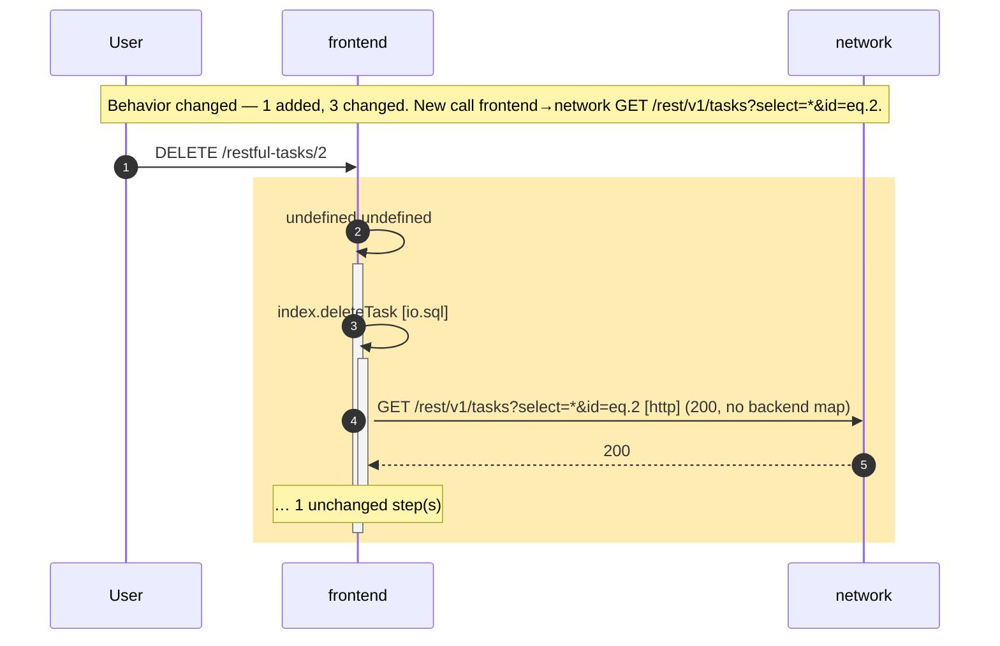

# DELETE /restful-tasks/2

> Behavior changed — 1 added, 3 changed. New call frontend→network: GET /rest/v1/tasks?select=*&id=eq.2.

```mermaid
sequenceDiagram
  autonumber
  participant User as User
  participant FE as frontend
  participant BE0 as network
  %% Behavior changed — 1 added, 3 changed. New call frontend→network: GET /rest/v1/tasks?select=*&id=eq.2.
  Note over User,BE0: Behavior changed — 1 added, 3 changed. New call frontend→network GET /rest/v1/tasks?select=*&id=eq.2.
  User->>FE: DELETE /restful-tasks/2
  rect rgb(255, 236, 179)
  FE->>FE: undefined.undefined
  activate FE
  rect rgb(255, 236, 179)
  FE->>FE: index.deleteTask [io.sql]
  activate FE
  rect rgb(255, 236, 179)
  FE->>BE0: GET /rest/v1/tasks?select=*&id=eq.2 [http]  (200, no backend map)
  BE0-->>FE: 200
  end
  Note over FE: … 1 unchanged step(s)
  deactivate FE
  end
  deactivate FE
  end
```
