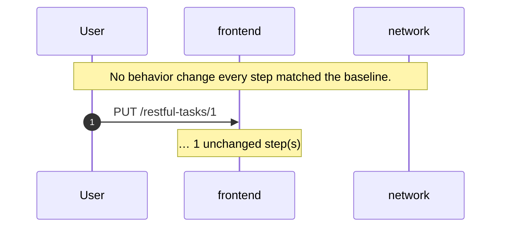

# PUT /restful-tasks/1

> No behavior change: every step matched the baseline.

```mermaid
sequenceDiagram
  autonumber
  participant User as User
  participant FE as frontend
  participant BE0 as network
  %% No behavior change: every step matched the baseline.
  Note over User,BE0: No behavior change every step matched the baseline.
  User->>FE: PUT /restful-tasks/1
  Note over FE: … 1 unchanged step(s)
```
